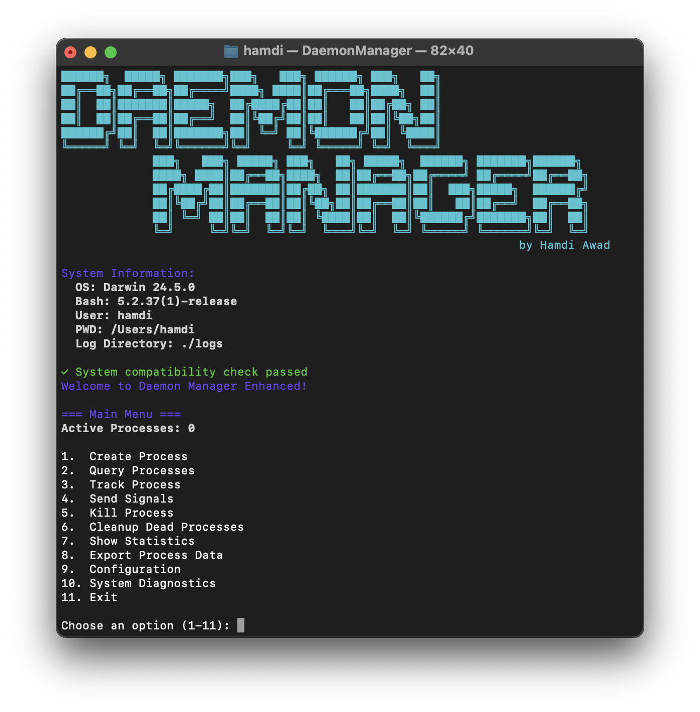

# Daemon Manager

[](https://www.gnu.org/software/bash/)
[](https://en.wikipedia.org/wiki/C_(programming_language))

## Overview

`DaemonManager` is a comprehensive command-line tool for managing daemon processes and system signals. This enhanced version combines an intuitive Bash interface with a robust C program for advanced signal handling, providing developers and system administrators with powerful process management capabilities.

## Screenshot



*The Daemon Manager running in terminal, showing the main menu and process management capabilities*

## Features

### Core Features
- **Process Management**: Create, monitor, and control daemon processes
- **Signal Handling**: Advanced signal management with custom handlers
- **Real-time Monitoring**: Live process tracking and log monitoring
- **Process Statistics**: Detailed information about running processes
- **Configuration Management**: Customizable settings and preferences
- **Data Export**: Export process data in JSON format
- **Backup & Recovery**: Automatic backup of existing installations

### Extra Features
- **Multiple Process Types**: Counter processes, custom commands, file monitoring
- **Advanced Query Options**: System processes, process trees, resource usage
- **Graceful Shutdown**: Clean termination with optional process cleanup
- **State Persistence**: Save and restore process states across sessions
- **Error Handling**: Comprehensive error checking and validation
- **Colored Output**: Beautiful, readable terminal interface
- **Process Limits**: Configurable maximum process limits
- **Log Management**: Organized logging with rotation support

## Prerequisites

- **Operating System**: Linux or macOS with Bash support
- **Compiler**: GCC (GNU Compiler Collection)
- **Shell**: Bash 4.0 or later
- **Privileges**: Root/sudo access for system-wide installation
- **Dependencies**: Standard POSIX utilities (ps, kill, tail, etc.)

## Installation

### Method 1: Enhanced Installation Script (Recommended)

```bash
# Clone the repository
git clone https://github.com/hamdiitarek/daemon-manager.git
cd daemon-manager

# Run the installation script
sudo ./install.sh
```

### Method 2: Using Makefile

```bash
# Build and install using make
make all
sudo make install
```

### Method 3: Manual Installation

```bash
# Compile the C program
gcc -Wall -Wextra -std=c99 -O2 -o signal_handler signal_handler.c

# Copy files to system directory
sudo cp DaemonManager /usr/local/bin/
sudo cp signal_handler /usr/local/bin/
sudo chmod +x /usr/local/bin/DaemonManager
sudo chmod +x /usr/local/bin/signal_handler
```

### Installation Options

The installation script supports several options:

```bash
sudo ./install.sh --help          # Show help
sudo ./install.sh --force         # Force installation
sudo ./install.sh --backup        # Create backup only
sudo ./install.sh --uninstall     # Uninstall Daemon Manager
```

## Usage

### Starting Daemon Manager

```bash
DaemonManager
```

### Main Menu Options

1. **Create Process**: Create new daemon processes
   - Simple counter processes
   - Custom command execution
   - File/directory monitoring

2. **Query Processes**: View process information
   - All system processes
   - Managed processes only
   - Specific process details
   - Process tree visualization
   - System resource usage

3. **Track Process**: Monitor process logs in real-time

4. **Send Signals**: Advanced signal handling interface

5. **Kill Process**: Terminate processes gracefully or forcefully

6. **Cleanup Dead Processes**: Remove terminated processes from management

7. **Show Statistics**: Display system and tool statistics

8. **Export Process Data**: Export process information to JSON

9. **Configuration**: Manage tool settings

10. **Exit**: Clean shutdown with optional process cleanup

### Signal Handler Features

The signal handler program provides:

- **Custom Signal Handlers**: Override default signal behavior
- **Signal Information**: Detailed signal descriptions
- **Interactive Testing**: Send various signals for testing
- **Status Tracking**: Monitor handler state
- **Educational Mode**: Learn about different signal types

### Configuration Options

Edit `daemon_manager.conf` or use the configuration menu:

```bash
# Maximum processes
MAX_PROCESSES=50

# Log directory
LOG_DIRECTORY="./logs"

# Auto cleanup
AUTO_CLEANUP=true

# Verbose logging
VERBOSE_LOGGING=false
```

## File Structure

```
DaemonManager/
├── DaemonManager              # Main Bash script
├── signal_handler.c           # C signal handling program
├── install.sh                 # Enhanced installation script
├── uninstall.sh              # Uninstallation script
├── Makefile                  # Build automation
├── daemon_manager.conf       # Configuration file
├── README.md                 # This documentation
└── logs/                     # Log directory
    ├── daemon_manager.log    # Main application log
    ├── daemon_state.txt      # Process state file
    └── process_*.log         # Individual process logs
```

## Advanced Usage

### Creating Custom Processes

```bash
# Example: Create a custom monitoring process
DaemonManager
> 1 (Create Process)
> 2 (Custom command process)
> Command: "watch -n 1 'df -h'"
> Name: disk_monitor
```

### Monitoring System Resources

```bash
# View comprehensive system information
DaemonManager
> 2 (Query Processes)
> 5 (System resource usage)
```

### Exporting Process Data

```bash
# Export current process data to JSON
DaemonManager
> 8 (Export Process Data)
# Creates: logs/daemon_export_YYYYMMDD_HHMMSS.json
```

### Signal Testing

```bash
# Test signal handling
DaemonManager
> 4 (Send Signals)
> 1 (Override signal handlers)
> 9 (Send SIGINT Signal)
```

## Development

### Building from Source

```bash
# Clone repository
git clone https://github.com/hamditarek/daemon-manager.git
cd daemon-manager

# Build signal handler
make all

# Run tests
make test

# Build with debug information
make debug
```

### Code Structure

- **DaemonManager**: Main Bash script with modular functions
- **signal_handler.c**: C program for signal management
- **install.sh**: Installation automation with error handling
- **Makefile**: Build system for easy compilation


### Debug Mode

Enable verbose logging in configuration:
```bash
VERBOSE_LOGGING=true
```

### Log Analysis

```bash
# View main application log
tail -f logs/daemon_manager.log

# View specific process log
tail -f logs/process_1.log

# View all logs
find logs/ -name "*.log" -exec tail -f {} +
```

## 🔒 Security

### Permissions

- Installation requires root privileges
- Running requires user-level permissions
- Process isolation through `setsid`
- Safe signal handling

### Best Practices

- Regular cleanup of old log files
- Monitor process resource usage
- Use process limits to prevent resource exhaustion
- Validate custom commands before execution

**Note**: This tool is designed for educational and development purposes. Use responsibly and ensure you understand the implications of signal handling and process management in production environments.

